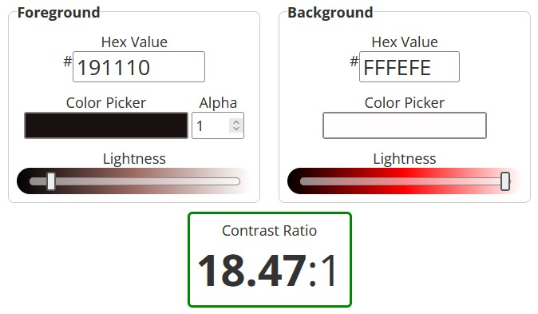

# Reach Out

Reach Out is a site focused on mental health awareness with a focus on providing individuals with relevant information to feel comfortable and safe reaching out for help with their mental health. It is filled with tips on how to manage the symptoms of common problems such as: depression, anxiety, and stress. It also has a page dedicated to listing helplines and large mental health organisations.

## User Experience:

### User stories:

- AS A user I WANT to see a welcoming homepage SO THAT I can feel comfortable.
- AS A user I WANT a list of helplines and resources SO THAT I can get immediate help if i need it.
- AS A user I WANT to see a dedicated section for mental health tips SO THAT I can apply them to my personal life.  

## Features 

### Existing Features

- __Navigation Bar__

  - Featured on all three pages, the full responsive navigation bar includes links to the Logo, Home page, About section, Mental Health Tips section, Resources & helplines page and Contact page and is identical in each page to allow for easy navigation.
  - This section will allow the user to easily navigate from page to page across all devices without having to revert back to the previous page via the ‘back’ button. 

- __Hero Image__

  - The header contains a hero image with the project name and tagline overlayed on top with text shadow for decoration and readablilty.

- __Mental Health Tips Section__

  - This section contains general tips and advise on how to manage the symptoms of depression, anxiety and stress. I chose these because they're common and most people will experience at least some symptoms of these conditions at some point in their life.

- __Helplines Section__

  - This section provides the user with some helplines that they could call or text to get help if they need it in that moment.

-___Organisations Section__

  - This section lists some mental health organisations that the user can look into or contact for services like therapy or treatment.

-___Contact Form__

  - There is a contact form on the contact us page to make it easy for users to contact us for further information and personalised resources.

- __The Footer__ 

  - The footer section includes links to social media such as facebook, instagram and twitter (now known as X).
  - It also has the copyright.

### Features Left to Implement

- More tips for a variety of symptoms and mental health problems.
- More helplines and orgs.
- Links to support groups.

## Accesiblity

- All of the images used throughout this project have alt-titles 
- I ensured that all foreground and background colours had good contrast. For example:

- I noticed that the text was a bit too small on desktop so I increased the font-size via a media query to increase readability on larger screens.
- As aformentioned, I added a text-shadow for further readability on the text overlaying the hero image.

## Testing 

### Validator Testing 
I consistantly tested the validity of my html throughout the process of writing it to ensure I wasn't blindsided by lots of confusing errors on the last day.
- HTML
  - No errors were returned when passing through the official W3C markup validator. 
  - [index.html](./assets/docs/valid-index.jpg)
  - [resources.html](./assets/docs/valid-resources.jpg)
  - [contact.html](./assets/docs/valid-contact.jpg)
- CSS
  - No errors were found when passing through the official W3C CSS validator.
  - [css](./assets/docs/valid-css.jpg)

### Lighthouse Testing

I tested all webpages with lighthouse - both desktop and mobile versions.
- Home Page
  -[mobile](./assets/docs/lighthouse-mobile-index.jpg)
  -[desktop](./assets/docs/lighthouse-desktop-index.jpg)
- Helplines & Resources Page
  -[mobile](./assets/docs/lighthouse-mobile-resources.jpg)
  -[desktop](./assets/docs/lighthouse-desktop-resources.jpg)
- Contact Page
  -[mobile](./assets/docs/lighthouse-mobile-contact.jpg)
  -[desktop](./assets/docs/lighthouse-desktop-contact.jpg)

### Manual Testing 

I also manual testing of all of the links, ensuring that all of the internal and external links work. 
In my testing, I found out that there was problems with the link in the navbar to the homepage. On further investigation and troubleshooting, I realised that I had accidentally linked to the wrong page. I fixed that promptly.

## Deployment

I deployed the project via github pages at the end of the first day. 
I went to the settings of the repo, clicked on pages on the side bar, selected deploy from branch and then selected the main branch.

The live link can be found here - https://aminoacid-01.github.io/reach-out/

## Credits 

- Bootstrap - nav bar and form.
- All images from [pexels.com](pexels.com).

### Content 

- Text for mental health tips was either paraphrased or pasted from multiple NHS webpages.
- Helplines and Resources - Taken from the Mind website.
- About section and introductory text on the contact and resources pages were generated by copilot.

